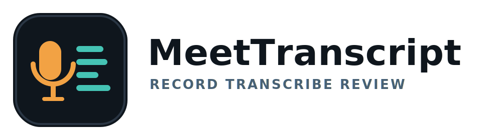

# Meet Transcript (macOS)



[](https://buymeacoffee.com/gadgetfather)

Meet Transcript records meeting audio on macOS and writes local transcripts.

It supports:
- Microphone audio (`You`)
- Optional system audio (`Participant 1..N` via best-effort diarization)
- Zoom, Teams, Slack huddles, Google Meet (browser), YouTube, etc.

All outputs are saved in:
- `Testing/<timestamp>/transcript.md`
- `Testing/<timestamp>/transcript.json`
- `Testing/<timestamp>/insights.md`
- raw audio (`microphone.caf`, `system.caf`)

## Quick Start (2 commands)

```bash
make setup
make run
```

Equivalent without `make`:

```bash
./scripts/setup.sh
./scripts/run.sh
```

## Build A DMG For Distribution

Generate the app icon (`Brand/MeetTranscript.icns`) before packaging:

```bash
make icon
```

```bash
./scripts/build_dmg.sh --variant lite
```

Output:
- `dist/MeetTranscript-lite.dmg`

Variants:

```bash
# Small DMG (default). Downloads Whisper model on first transcription.
./scripts/build_dmg.sh --variant lite

# Bigger DMG. Bundles Whisper model files for offline-first use.
./scripts/build_dmg.sh --variant full --model base.en

# Build both files in one run.
./scripts/build_dmg.sh --variant both --model base.en
```

Also available with Make:

```bash
make dmg-lite
make dmg-full
make dmg-both
```

Notes:
- Both variants bundle `.venv` and Python transcription scripts so recipients do not need setup manually.
- `full` also bundles the Whisper model, so first transcription works without internet.
- Transcript output for DMG installs is written to:
  - `~/Documents/MeetTranscript/Testing/`
- Unsigned DMG builds may show a macOS Gatekeeper warning. For wider public distribution, add Apple code signing + notarization.

## Requirements

- macOS 13+
- Xcode Command Line Tools (`xcode-select --install`)
- Python 3.10+

## What `setup` does

- Creates `.venv`
- Installs Python deps from `requirements.txt` (`faster-whisper`)
- Runs a Swift build preflight

Useful flags:

```bash
./scripts/setup.sh --skip-python-deps
./scripts/setup.sh --skip-build
```

## Permissions (first run)

- Microphone permission is required.
- Screen Recording permission is required only if `Include system audio` is enabled.
- If denied earlier, enable manually:
  - System Settings -> Privacy & Security -> Microphone / Screen Recording

## Speaker labels

- `You`: microphone track
- `Participant 1..N`: diarized system-audio speakers
- `Others`: fallback when diarization is not confident/available
- `Mixed`: fallback mixed transcription path

## Notes

- System audio capture is optional and off by default.
- On first transcription, Whisper may download model files (cached locally in `.cache/`).

## Support

If this project helps you, you can support it here:
- https://buymeacoffee.com/gadgetfather

## Next improvements

- Per-app system audio capture (target only Zoom/Teams process)
- `.srt` export
- Manual participant name mapping (`Participant 1` -> real name)
